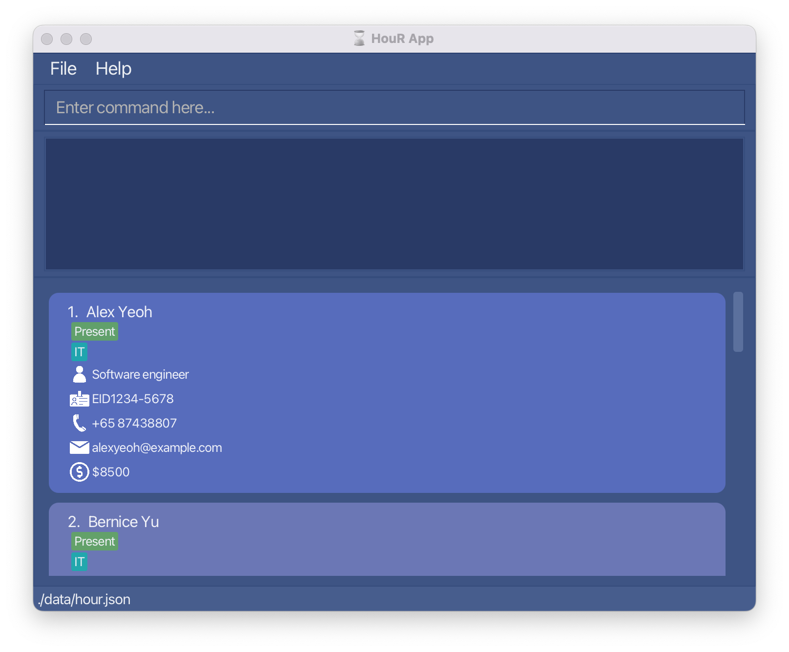
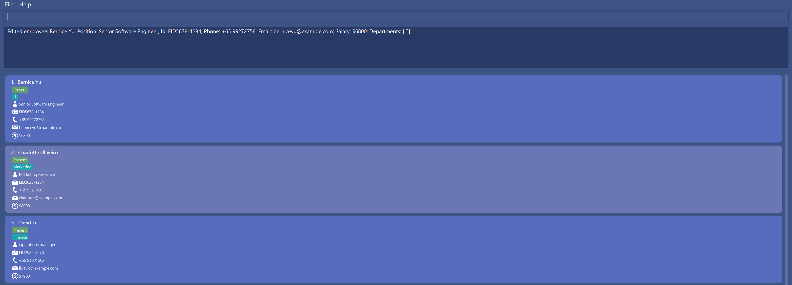
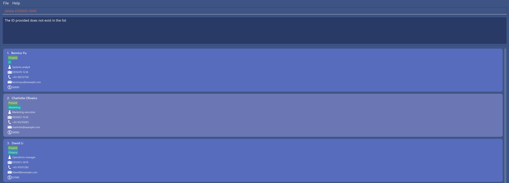

HouR is a **desktop app for managing employee records, optimized for use via a Command Line Interface** (CLI) while still having the benefits of a Graphical User Interface (GUI). If you can type fast, HouR can get your HR management tasks done faster than traditional GUI apps.

* Table of Contents
{:toc}

--------------------------------------------------------------------------------------------------------------------

## Quick start

1. Ensure you have Java `11` or above installed in your Computer.

1. Download the latest `hour.jar` from [here](https://github.com/AY2324S1-CS2103T-W12-1/tp/releases).

1. Copy the file to the folder you want to use as the _home folder_ for your employee list.

1. Open a command terminal, `cd` into the folder you put the jar file in, and use the `java -jar hour.jar` command to run the application. 
   A GUI similar to the below should appear in a few seconds. Note how the app contains some sample data. 
   

1. Type the command in the command box and press Enter to execute it. e.g. typing **`help`** and pressing Enter will open the help window. 
   Some example commands you can try:

   * `help`: Shows help window with link to user guide.

   * `add n/John Doe pos/Senior Software Enginner id/EID2023-7890 p/81239876 e/johndoe@test.com s/$5,000` : Adds an employee named `John Doe` to the employee list.

   * `list` : Lists all employees.
   
   * `edit 1 n/Alex Yeoh`: Edits the name of the 1st employee shown in the current list to `Alex Yeoh`.
   
   * `find Alex`: Lists all employees with the keyword `Alex`.

   * `delete EID1234-5678` : Deletes the employee with employee id EID1234-5678 shown in the list.

   * `sort by/Salary`: Sorts the employees by their salaries in ascending order.
   * 
   * `clear` : Deletes all employees.

   * `exit` : Exits the app.

1. Refer to the [Features](#features) below for details of each command.

--------------------------------------------------------------------------------------------------------------------

## Features

- List of commands: `help`
- Add an employee: `add`
- Delete an employee: `delete`
- Edits an employee: `edit`
- List all employees: `list`
- Find employees by name: `find`
- Sorts employees by attribute: `sort`
- Clear all employees: `clear`
- Exit the program: `exit`

**:information_source: Notes about the command format:** 

* Words in `UPPER_CASE` are the parameters to be supplied by the user. 
  e.g. in `add n/NAME`, `NAME` is a parameter which can be used as `add n/John Doe`.

* Items in square brackets are optional. 
  e.g. `edit INDEX [n/NAME] [pos/POSITION] [id/EMPLOYEE_ID] [p/PHONE_NUMBER] [e/EMAIL] [s/SALARY] [d/DEPARTMENT]...` can be used as `edit 1 n/John Doe` or as `edit 1 pos/Software Engineer`.

* Parameters can be in any order. 
  e.g. if the command specifies `n/NAME p/POSITION`, `p/POSITION n/NAME` is also acceptable.

* Extraneous parameters for commands that do not take in parameters (such as `help`, `list`, `exit` and `clear`) will be ignored. 
  e.g. if the command specifies `help 123`, it will be interpreted as `help`.

* If you are using a PDF version of this document, be careful when copying and pasting commands that span multiple lines as space characters surrounding line-breaks may be omitted when copied over to the application.

### Viewing help : `help`

Shows a message explaining how to access the help page.

Format: `help`

### Adding an employee: `add`

Adds an employee to the employee list.

Format: `add n/NAME pos/POSITION id/EMPLOYEE_ID p/PHONE_NUMBER e/EMAIL s/SALARY [d/DEPARTMENT]...`

Examples:
* `add n/Jane Doe pos/Manager id/EID2023-7891 p/81234567 e/janedoe@test.com s/$5,000`
* `add n/Alex Yeoh pos/Software Engineer id/EID2023-1234 p/87428807 e/alexyeoh@example.com s/$8,500 d/IT`

* `add n/Alex Yeoh pos/Software Engineer id/EID2023-1234 p/98561234 e/alexyeoh2@example.com s/$9,500 d/IT` is invalid because `name` and `id` already exists in the records.

### Listing all employees : `list`

Shows a list of all employees in the employee list.

Format: `list`

### Editing an employee : `edit`

Edits an existing employee in the employee list.

Format: `edit INDEX [n/NAME] [pos/POSITION] [id/EMPLOYEE_ID] [p/PHONE_NUMBER] [e/EMAIL] [s/SALARY] [d/DEPARTMENT]...`

* Edits the employee at the specified `INDEX`. The index refers to the index number shown in the displayed employee list. The index **must be a positive integer** 1, 2, 3, …​
* At least one of the optional fields must be provided.
* Existing values will be updated to the input values.

Examples:
*  `edit 1 pos/Senior Software Engineer` edits the position of the 1st employee to be `Senior Software Engineer`.

*  `edit 10 pos/Senior Software Engineer` is invalid because the index does not exist.

### Locating employees by name: `find`

Finds employees whose names contain any of the given keywords.

Format: `find KEYWORD [MORE_KEYWORDS]`

* The search is case-insensitive. e.g `hans` will match `Hans`
* The order of the keywords does not matter. e.g. `Hans Bo` will match `Bo Hans`
* Only the name is searched.
* Only full words will be matched e.g. `Han` will not match `Hans`
* Persons matching at least one keyword will be returned (i.e. `OR` search).
  e.g. `Hans Bo` will return `Hans Gruber`, `Bo Yang`

Examples:
* `find Alex` returns `Alex Yeoh`
* 

### Deleting an employee : `delete`

Deletes an employee from the employee list.

Format: `delete EMPLOYEE_ID`

* Deletes the employee at the specified `EMPLOYEE_ID`.
* The employee id refers to each employee's unique employee id.
* The employee id **must be follow the EID format** (EID[4 digits]-[4 digits])

Examples:
* `delete EID1234-5678` deletes the employee with employee id EID1234-5678 in the employee list.
 
  

* `delete EID000-0000` is invalid because the id does not exist.

### Sorting all employees : `sort`

Sorts the employee list by a given attribute.

Format: `sort by/ATTRIBUTE`

* Sorts the employee list by the specified `ATTRIBUTE` in ascending order (by default).
* The attribute has to be non-empty and exist (Position/ID/Phone/Email/Salary)

Examples:
* `sort by/Salary` deletes the employee with employee id EID1234-5678 in the employee list.

* `sort by/blah` is invalid because it does not exist.

### Clearing all entries : `clear`

Clears all entries from the employee book.

Format: `clear`

### Exiting the program : `exit`

Exits the program.

Format: `exit`

### Saving the data

HouR data are saved in the hard disk automatically after any command that changes the data. There is no need to save manually.

### Editing the data file

HouR data are saved automatically as a JSON file `[JAR file location]/data/hour.json`. Advanced users are welcome to update data directly by editing that data file.

:exclamation: **Caution:**
If your changes to the data file makes its format invalid, HouR will discard all data and start with an empty data file at the next run. Hence, it is recommended to take a backup of the file before editing it.

### Archiving data files `[coming in v2.0]`

_Details coming soon ..._

--------------------------------------------------------------------------------------------------------------------

## FAQ

**Q**: How do I transfer my data to another Computer? 
**A**: Install the app in the other computer and overwrite the empty data file it creates with the file that contains the data of your previous HouR home folder.

--------------------------------------------------------------------------------------------------------------------

## Known issues

1. **When using multiple screens**, if you move the application to a secondary screen, and later switch to using only the primary screen, the GUI will open off-screen. The remedy is to delete the `preferences.json` file created by the application before running the application again.

--------------------------------------------------------------------------------------------------------------------

## Command summary

Action | Format, Examples
--------|------------------
**Add** | `add n/NAME pos/POSITION id/EMPLOYEE_ID p/PHONE_NUMBER e/EMAIL s/SALARY [d/DEPARTMENT]...`   e.g., `add n/James Ho pos/Auditor id/EID2023-0928 p/87651234 e/jamesho@example.com s/$8,000`
**Clear** | `clear`
**Delete** | `delete EMPLOYEE-ID`  e.g., `delete EID1234-5678`
**Edit** | `edit INDEX [n/NAME] [p/POSITION] [id/EMPLOYEE_ID] [p/PHONE_NUMBER] [e/EMAIL] [s/SALARY] [d/DEPARTMENT]...`  e.g.,`edit 2 n/James Lee pos/Head Auditor`
**Find** | `find KEYWORD [MORE_KEYWORDS]`  e.g., `find James Jake`
**List** | `list`
**Sort** | `sort by/ATTRIBUTE`
**Help** | `help`
**Exit** | `exit`
